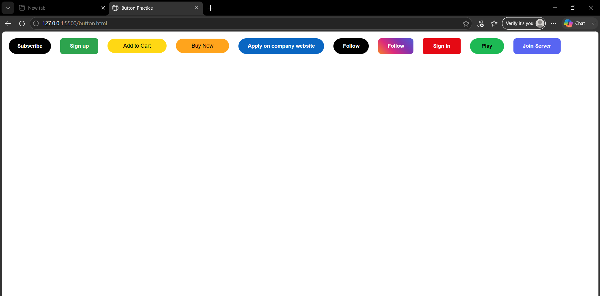

# 🎨 HTML & CSS Button Clone Collection

A beginner-friendly frontend project that recreates popular buttons from platforms we use every day using pure HTML and CSS.

This project was built as part of my web development learning journey while practicing CSS styling, hover effects, transitions, gradients, and modern UI design.

---

## 📸 Preview



---

## 🚀 Buttons Included

- YouTube Subscribe Button
- GitHub Sign Up Button
- Amazon Add to Cart Button
- Amazon Buy Now Button
- LinkedIn Apply Button
- X/Twitter Follow Button
- Instagram Follow Button
- Netflix Sign In Button
- Spotify Play Button
- Discord Join Server Button

---

## ✨ Features

- Built using only HTML and CSS
- Hover effects and smooth transitions
- Gradient styling
- Rounded buttons and modern UI design
- Clean and beginner-friendly code
- No frameworks or libraries used

---

## 🛠️ Tech Stack

| Technology | Usage |
|------------|--------|
| HTML5 | Structure |
| CSS3 | Styling and Animations |

---

## 📂 Project Structure

```text
html-css-button-clone/
│
├── button.html
├── screenshot.png
└── README.md
```

---

## ⚡ Getting Started

### Clone the repository

```bash
git clone https://github.com/mirunalinibuilds/html-css-button-clone.git
```

### Open the project

Simply open:

```text
button.html
```

in your browser.

No installation required.

---

## 🎯 What I Learned

Through this project, I practiced:

- CSS Classes
- Padding and Margins
- Border Radius
- Hover Effects
- CSS Transitions
- Box Shadows
- Linear Gradients
- Recreating Real-World UI Components

---

## 🔮 Future Improvements

- Add responsive layouts
- Create more button variants
- Add click animations
- Build a reusable UI component library
- Convert components into React

---

## 🤝 Contributing

Suggestions and improvements are always welcome.

Feel free to fork the repository and submit a pull request.

---

## ⭐ Support

If you like this project, consider giving it a star.

It helps others discover the project and motivates me to keep building and sharing my learning journey.

---

## 👩‍💻 Author

**Mirunalini A. R.**

Computer Science Engineering Student | Learning Web Development One Project at a Time
